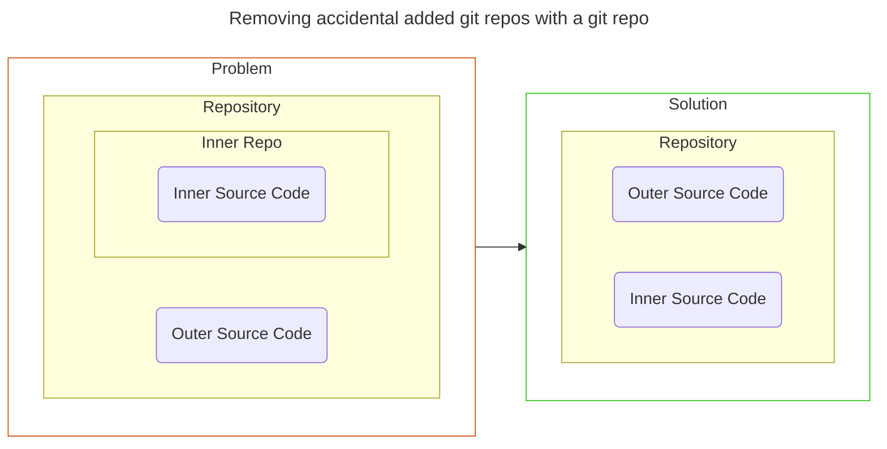

# git

## SSH Keygen
```sh
# generate a ed25519 ssh key
ssh-keygen -t ed25519 -C "comment"

# show public key
cat ~/.ssh/id_ed25519.pub
```

## Signing Commits (GPG)

- Generate GPG Key
```sh
gpg --full-gen-key
```

- Show list of GPG Keys
```sh
gpg --list-secret-keys --keyid-format LONG <EMAIL>

# OUTPUT
sec   rsa4096/30F2B65B9246B6CA 2017-08-18 [SC]
      D5E4F29F3275DC0CDA8FFC8730F2B65B9246B6CA
uid                   [ultimate] Mr. Robot <your_email>
ssb   rsa4096/B7ABC0813E4028C0 2017-08-18 [E]

#----------------------------------------------------
``````md
# Template
sec   rsa4096/**<______ID______>** 2017-08-18 [SC]
      D5E4F29F3275DC0CDA8FFC8730F2B65B9246B6CA
uid                   [ultimate] Mr. Robot <your_email>
ssb   rsa4096/B7ABC0813E4028C0 2017-08-18 [E]
```

- Show GPG Public Key
```sh
# cat 
gpg --armor --export <ID>

# In the example above, the specific command would be 
gpg --armor --export 30F2B65B9246B6CA
```

- Adding GPG to git
```sh
# Omit `--global` if you don't want it to be a global git change
git config --global user.signingkey <ID>

# Using the example ID above, the command would look like this
git config --global user.signingkey 30F2B65B9246B6CA

```

- Resources:
  - https://docs.gitlab.com/ee/user/project/repository/signed_commits/gpg.html
  - https://docs.github.com/en/authentication/managing-commit-signature-verification/telling-git-about-your-signing-key


## Removing Git Submodules

- What happens if you accidentally add a git repo inside a git repo, and you want to just have the outer repo track the changes on the inner repo?
  - Check diagram below for better explaination!



- The commands to fix issue:
  - `git rm --cached <dir> --force`: removes the added code
  - `rm -rf <dir>/.git` : removes the inner .git module

```bash
# template
git rm --cached <dir> --force
rm -rf <dir>/.git

# example
git rm --cached examples/rust --force
rm -rf examples/rust

```