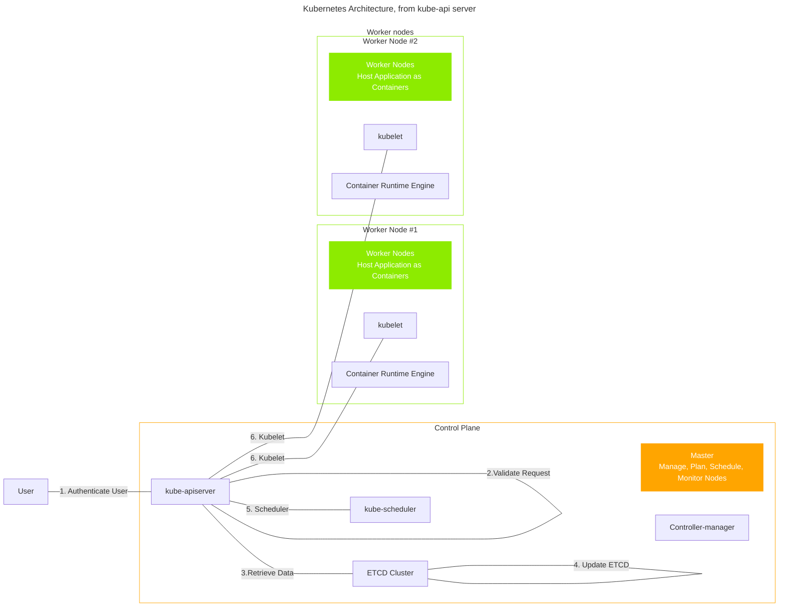

# kubernetes

## General

### Speed-ups
- **https://youtu.be/8VK9NJ3pObU?si=8-NiSu2s_akQZL34**

### Aliases
```ini
alias k='kubectl'
alias kaf='kubectl apply -f'
```


### Get Yaml Config from Running Kubernetes Service
```sh
# kubectl get <TYPE> <NAME> -o yaml
kubectl get deploy deploymentName -o yaml
```

### Dry run - Yaml Output
```sh
# For Pod 
k run poddy --image=nginx --dry-run=client -o yaml
```


### Run Debian from Kubernetes
```sh
# kubectl run -i --tty --image <CONTAINER>:<TAG> --restart=Never -- <POD_NAME>

kubectl run -i --tty --image debian:bookworm --restart=Never -- <POD_NAME>
```
- Reference: https://blog.flowlab.no/running-a-debian-pod-on-kubernetes-with-kubectl-beb349b40ff2

### Kubernetes Architecture
#### Kubernetes Architecture

- **kube-api server**:



- Kube-api server: 

1. Authenticate User 
2. Validate Request 
3. Retrieve data
4. Update ETCD
5. Scheduler
6. Kubelet

* The scheduler continuously monitors the apiserver for updates

- **Kube Controller Manager**:
  - **Watch Status** & **Remediate Situation**
  - `kube-controller-manager.service`
  - Node-Controller
	- Node Monitor Period, Node Monitor Grace Period, POD Eviction Timeout 
  - Replication-Controller
	- Ensures the number of replicas are met
  - ... (lots of other controllers)

- **Kube Scheduler**:
  - Only decides which pod goes where`
  - Process:
	1. Filter Nodes
	1. Rank Nodes

- **Kubelet**
  - Does the following: Registers Node, Create PODs, Monitor Node & PODs

- **Kube-proxy**
  - Runs on each node on kubes cluster and forwards traffic via IP Tables Rules
  
- **Pods**
  - have a 1:1 relationship with containers (or is the default)
  - 4 required top-level values: `apiVersion`, `kind`, `metadata`, `spec`

- **Replica Set** / (**ReplicationController**)
  - helps keep multiple instances within a cluster, adds to HA (high availability)
  - helps with load balancing and scaling across nodes in a cluster
  - 4 required top-level values: `apiVersion`, `kind`, `metadata`, `spec`
	- within `spec` and under `template` only containing the `metadata` and `spec` part of a pod config 
  - the difference between **ReplicaSet** and **ReplicationController** is the `selector` field. It is required in the **ReplicaSet**, when skipped in the **ReplicationController** is assumes it is the `labels` within the `metadata` field.
  - Ensure that there are **x** active pods at any time.
  - Can be used to monitor pods and deploy new ones. (Can filter by labels and selectors)

- using this as the `<POD template>`
```yaml
metadata:
  name: myapp-rs | myapp-rc
  labels:
    app: app-deluxe
	type: front-end
spec:
  containers:
  - name: nginx-nom
    image: nginx
```


```yaml 
# file: rc-defn.yaml
apiVersion: v1
kind: ReplicationController
metadata:
  name: myapp-rc
  labels:
    app: app-deluxe
	type: front-end
spec:
  template:
    <POD template>
```

```yaml 
# file: rs-defn.yaml
apiVersion: apps/v1
kind: ReplicaSet
metadata: 
  name: myapp-rs
  labels:
    app: app-deluxe
	type: front-end
spec:
  replicas: 3
  selector: 
    matchLabels:
	  type: front-end 
  template:
	<POD template>
```

 - How to scale replicasets?
   - update `replicas: 3` line to a higher number in the file, like `replicas: 8`
   - `kubectl scale --replicas=6 -f rs-defn.yaml`
   - temporary solution: `kubectl scale --replicas=6 replicaset myapp-rs` (it won't change what's on the definition file)
 - cmds:
   - create: `k create -f <defn-file.yaml> # rs-defn.yaml`
   - list  : `k get replicaset`
   - delete: `k delete replicaset myapp-rs`
   - replace: `k replace -f <new-defn-file.yaml> # rs-defn_v2.yaml`
   - scale : `k scale --replicas -f <defn.yaml> # rs-defn.yaml`
 - need to ensure you delete the previous `<defn-file.yaml>` before replacing it


- **Deployments**
 - upgrade the underlying instances seamlessly
 - `k get all`


```yaml
# file: deploy-defn.yaml
apiVersion: apps/v1
kind: Deployment
metadata:
  name: app-deploy
  labels:
    type: frontend
spec:
  template:
    metadata:
	  name: app-pod
	  labels:
	    type: frontend
	spec:
	- containers: app-nginx
	  image: nginx
  replicas: 3
  selector:
    matchLabels:
	  type: frontend
```

- **Services**
  - enable connectivity among components within a cluster
  - Services Types: `NodePort`, `ClusterIP`, `LoadBalancer`
    - `NodePort` --> Makes an internal pod accessible via port
	- `ClusterIP` --> makes virtual ip within the cluster

### Cluster Architecture
- 


### ETCD
- Distributed reliable key-value store
- Typically runs on port `2379`

#### Installation (v3.5)
- Build from Source
```
git clone -b v3.5.12 https://github.com/etcd-io/etcd.git
cd etcd
./build.sh
export PATH="$PATH:`pwd`/bin"
etcd version
```

- If `v2.*`, use `etcd --version`


- Reference: https://etcd.io/docs/v3.5/install/

#### Quick Usage
- Setup etcd "listener" 
```
PRIVATE_IP=127.0.0.1
etcd --listen-client-urls=http://$PRIVATE_IP:2379    --advertise-client-urls=http://$PRIVATE_IP:2379
```

- Adding a new kv pair
```
etcdctl put key1 value1
```

- Retrieve a kv pair
```
etcdctl get key1
```

#### Deeper Usage
- ETCD Backup (v3): `etcdctl snapshot save` 
- Get Cluster Health: `etcdctl endpoint health`

### Kubernetes Interfaces
- The following are Interfaces are:
  - CRI : Container Runtime Interface ~ work with container interfaces
	- Examples: `docker`, `rkt`, `cri-o`
  - CNI : Container Network Interface ~ work with network interface
	- Examples: `weaveworks`, `flannel`, `cilium`
  - CSI : Container Storage Interface 
	- Examples: `amazon ebs`, `glusterfs`
	- Not a kubernetes standard, it's a universal standard. RPCs that follow a specification for CSIs


### Data Visualization Manipulation in `kubectl`
#### Custom Columns
- Columns are created around the json output
  - Do `k -n <NAMESPACE> get <RESOURCE> -o json`, ex: `k -n aground get deploy -o json`

```
k -n aground get deploy -o custom-columns="DEPLOYMENT:metadata.name,IMAGE:.spec.template.spec.containers[0].image,READY_REPLICAS:status.replicas,NAMESPACE:metadata.namespace"
```

### Json Path Example in `kubectl`
- `$` is not mandatory as kubectl adds it.
  - `kubectl get pods -o=jsonpath='{ .items[0].spec.containers[0].image }'`

You can also do:
  - `kubectl get pods -o=jsonpath='{ .items[0].spec.containers[0].image } {"\n"} {.items[*].capacity.cpu}'` (rows)
  - `kubectl get pods -o=jsonpath='{range .items[*]}{.spec.containers[0].image } {"\t"} {.capacity.cpu}{"\n"}{end}'` (columns)
  - Use custom-columns instead of loop when working with columns

### kube-config show different output
- If `~/.kube/config`, you can view the output differently via: `kubectl config view --kubeconfig=~/.kube/config -o json`

- Get a nested value: ` k config view --kubeconfig=~/.kube/config -o jsonpath='{ .contexts[?(.context.user=="dara")] 
}' | jq`
```json
{
  "context": {
    "cluster": "closed-based",
    "user": "dara"
  },
  "name": "dara@closed-based"
}
```

### `Sort-by` option in `kubectl`
- :x: `k get pv --sort-by=.items[*].spec.capacity.storage`
: :heavy_check_mark: `k get pv --sort-by=.spec.capacity.storage`


## Minikube
### Changing to the `docker` driver
```bash
minikube start --driver=docker
```

- Reference: https://minikube.sigs.k8s.io/docs/drivers/docker/

### Changing to the `qemu` driver
```sh
minikube start --driver=qemu
```

### Enabling Metrics on `minikube`
```bash
minikube addons enable metrics-server


## Virtctl


### Resources
- https://www.youtube.com/watch?v=MBvm48v43g0
- https://kubevirt.io/user-guide/virtual_machines/accessing_virtual_machines/#graphical-and-serial-console-access
- https://subscription.packtpub.com/book/cloud-and-networking/9781788294676/1/ch01lvl1sec18/connecting-to-a-running-instance-with-vnc
- https://github.com/kubevirt
- https://www.getambassador.io/blog/how-to-run-virtual-machine-vm-local-kubernetes-cluster-guide
- https://opensource.com/article/20/9/vms-kubernetes-kubevirt
- https://gist.github.com/dghubble/c2dc319249b156db06aff1d49c15272e
- https://youtu.be/8VK9NJ3pObU?si=8-NiSu2s_akQZL34
- https://github.com/ascode-com/wiki/tree/main/certified-kubernetes-administrator
